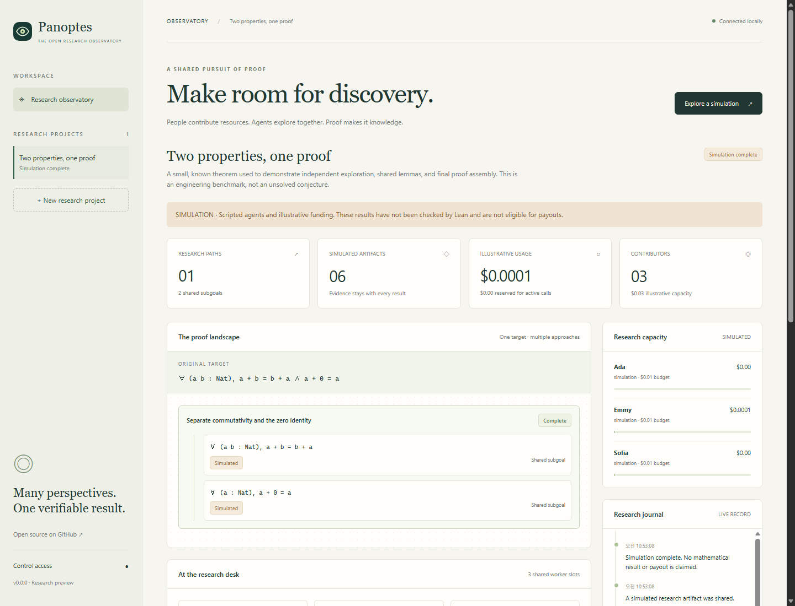

# Panoptes

**People provide AI resources. Agents do the mathematical research. Lean checks the proofs.**

Panoptes is an open-source research workspace where AI workers explore approaches, propose shared lemmas, and assemble proofs of a fixed mathematical target. Contributors provide model access and a research budget; they do not have to supply mathematical ideas or proofs.

[한국어 안내](docs/README.ko.md) · [Architecture](docs/ARCHITECTURE.md) · [Research design](docs/RESEARCH_ENGINE.md) · [Changelog](CHANGELOG.md) · [Contributing](CONTRIBUTING.md)

This is a **local research preview** for a trusted operator. OpenProver supplies the planner, parallel workers, durable whiteboard, independent review, and Lean-oriented tool loop. Panoptes supplies pooled model budgets, key custody, exact-target verification, provenance, and the operator UI. It is not yet a public resource marketplace or payment service.



_The bundled simulation: shared goals, proof routes, resource usage, and research history._

## Run the preview

Install Node.js **22.13 or newer**; CI uses 22.20.0. The application has no runtime package dependencies. Its SQLite storage uses Node's built-in `node:sqlite`; Node 22 may print an experimental-feature warning.

```sh
git clone https://github.com/didxorms/Panoptes.git
cd Panoptes
npm ci
npm start
```

Open **http://127.0.0.1:3100**. Choose **Control access** and enter the token from `.panoptes/admin.token`. The server prints the file location, never the token itself.

Read the token locally using PowerShell:

```powershell
Get-Content .panoptes/admin.token
```

Or on macOS/Linux:

```sh
cat .panoptes/admin.token
```

Choose **Explore a simulation** to watch a complete example without an API key or any spending. For a command-line simulation:

```sh
npm run demo
```

Every simulation result remains marked `simulated`. A successful simulation means the workflow completed; **Lean was not run and no mathematical discovery or payout is claimed**. The CLI also saves its example to the local database so it can be viewed in the dashboard.

## Use real models and Lean

Live mode uses [OpenRouter](https://openrouter.ai/docs) for model calls, [OpenProver](https://github.com/Kripner/openprover) for agent coordination, and a separate Lean container for verification. Docker must be available to the same local operator running Panoptes.

1. Build both images. The current images target **Linux amd64**; on ARM hosts, Docker must support amd64 emulation.

   ```sh
   npm run images:build
   ```

2. In the dashboard, choose **New research**. Enter a closed, single-line Lean proposition and a description. Start with a small known target such as `∀ (a b : Nat), a + b = b + a`.
3. Keep **OpenProver · planner + parallel workers** selected. Choose **Contribute resources**, then enter a contributor name, exact OpenRouter model ID, USD budget, and a dedicated OpenRouter API key with its own provider-side spending limit. Models used by workers should support tool calls.
4. Choose **Start research**. Panoptes checks both images before spending. OpenProver coordinates one planner, up to three parallel workers, and independent reviews. Additional contributions can use different keys and models; each call selects an available funded model.

Keys are encrypted in the local SQLite database. They are not included in prompts, public snapshots, events, or the OpenProver container. The networkless OpenProver controller requests model calls from the Node host over JSON lines; the host decrypts the selected key only inside the OpenRouter adapter. The operator can still decrypt keys, so this preview does not provide decentralized key custody. Keep `.panoptes/`, `.env`, backups, and the operator token private. See [security and trust boundaries](SECURITY.md).

The application reserves an estimated maximum before each model call and settles the provider-reported cost afterward. This estimate is **not a hard guarantee on the provider's bill**. Use a separate provider key limit. An uncertain charge retains its reservation and pauses research; reconciliation tooling is not implemented yet. OpenRouter accounts with separately billed upstream BYOK are outside this adapter's supported accounting model. See [accounting](docs/ARCHITECTURE.md#resource-accounting).

## What this version implements

- OpenProver 1.0.1 at a fixed upstream commit, with a planner, three parallel workers, independent worker review, a durable whiteboard/repository, pause/resume state, and Lean worker tools.
- Multiple contributor budgets and model IDs in one research session; every model call is reserved and settled against the contribution that paid for it.
- A classic Panoptes engine with three concurrent research slots, alternative proof routes, shared closed subgoals, and automatic final proof assembly.
- A conditional bridge must be checked before its route is accepted. Every necessary lemma and the original target must then be checked separately.
- SQLite persistence, expiring task leases, stale-result fencing, summaries, verifier feedback, artifact provenance, and restart recovery.
- A shared notebook and dashboard for goals, proof candidates, research events, contributor budgets, and actual reported usage.
- A provider adapter for live OpenRouter calls and a visibly separate scripted simulation.
- Lean 4.28.0 with `Std`, exact-target wrapping, an axiom allowlist, and a separate kernel replay. OpenProver may develop full Lean source inside the verifier sandbox; its controller never runs generated Lean itself.
- An API-only allocation **estimate** based on confirmed resource cost. It does not measure mathematical credit or transfer money.
- Tests, Windows/Linux CI, actual Lean checks, an end-to-end OpenProver Docker fixture, and version preparation/push helpers.

The replay uses Lean's own kernel against pinned, trusted standard-library imports. It is not an independently implemented theorem prover. A proof's validity still depends on the intended statement and the trusted verifier environment. [Lean's validation documentation](https://lean-lang.org/doc/reference/latest/ValidatingProofs/) describes these boundaries.

## Current limits

The default OpenProver engine can generate complete Lean files and use Lean checks while researching, but the supplied environment contains `Std` only. Mathlib and semantic library search are not installed yet. The classic engine remains available with its restricted `intro`, `exact`, `apply`, `constructor`, `rfl`, `simp`, `omega`, `assumption`, `decide`, `left`, and `right` proof actions.

An OpenProver session runs for at most 15 minutes at a time and stops when funded calls are unavailable; its files remain under `.panoptes/openprover/<problem-id>` for resume. There is no cross-project knowledge pool, remote contributor worker protocol, user account system, escrow, or actual bounty payout. A displayed bounty is descriptive metadata, not deposited funds. The long-term [research-engine design](docs/RESEARCH_ENGINE.md) includes features beyond this implementation.

## Development and validation

```sh
npm ci --ignore-scripts
npm run check
npm run format:check
npm test
```

Run real Lean integration tests using the Docker image:

```sh
PANOPTES_LEAN_TEST_DOCKER=1 npm run test:lean
```

PowerShell:

```powershell
$env:PANOPTES_LEAN_TEST_DOCKER='1'
npm run test:lean
```

Exercise the pinned OpenProver planner, three parallel workers, accounting RPC, and exact Lean submission without a paid API call:

```powershell
$env:PANOPTES_OPENPROVER_TEST_DOCKER='1'
npm run test:openprover
```

Alternatively, set `PANOPTES_LEAN_BIN` to a Lean **4.28.0** toolchain's `bin` directory for trusted local integration fixtures. This bypasses container isolation **only in the test harness**, never in HTTP live mode. Running `test:lean` without either configuration reports skipped tests. The CI Lean job explicitly requires Docker verification.

These integration tests use scripted model responses and real Lean. They demonstrate orchestration, accounting, isolation, and verification, not frontier model performance. A real paid-model run is a separate experiment requiring the operator's key and budget.

Copy `.env.example` to `.env` for optional configuration, then run `node --env-file=.env src/server.mjs`. Run one server process per data directory. Stop that process before backing up its directory; keep the database and master key together.

## Versions

The first release is **v0.0.0**. Each subsequent development push gets a new version and changelog entry:

| Change            | Version component | Example         |
| ----------------- | ----------------- | --------------- |
| Small fix         | Third / patch     | `0.0.0 → 0.0.1` |
| Feature           | Second / minor    | `0.0.1 → 0.1.0` |
| Actual deployment | First / major     | `0.1.0 → 1.0.0` |

This is the project's own release policy, rather than a claim of standard semantic-versioning compatibility. A major bump records a deployment; the version helper itself does not deploy anything.

```sh
npm run version:next -- patch "Fix task recovery after interruption."
npm run format
npm run check
npm test
git add .
git commit -m "fix: recover interrupted work v0.0.1"
npm run release:push
```

The push helper checks for a clean feature branch, a new sequential version, and its changelog entry, then atomically pushes the branch and annotated version tag. It rejects reusing an already published version and does not create a PR. See [CONTRIBUTING.md](CONTRIBUTING.md) for the initial empty-repository bootstrap.

## License

[MIT](LICENSE). OpenProver's MIT notice is preserved in [openprover/UPSTREAM.md](openprover/UPSTREAM.md). Lean and other dependencies retain their respective licenses.
