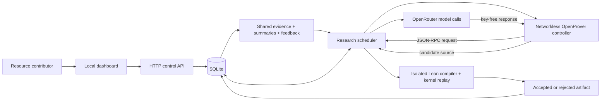

# Implemented architecture

This document describes v0.1.0. [RESEARCH_ENGINE.md](RESEARCH_ENGINE.md) is the broader design, not a list of completed features.

## Components



The runtime uses Node built-ins, SQLite, and a static browser application. Prettier is the only development package dependency. There is no bundler, Redis, job service, or separate database server.

| Module               | Responsibility                                                            |
| -------------------- | ------------------------------------------------------------------------- |
| `src/store.mjs`      | Persisted state, invariants, leases, budgets, evidence, route readiness   |
| `src/engine.mjs`     | Select the OpenProver or classic task path and promote checked evidence   |
| `src/providers.mjs`  | Scripted sample and real OpenRouter adapter                               |
| `src/openprover.mjs` | Controller lifecycle, RPC dispatch, budget selection, checkpoint handling |
| `src/lean.mjs`       | Structured and full-source exact-target verification                      |
| `src/vault.mjs`      | Local provider-key encryption                                             |
| `src/server.mjs`     | Read-only views, authenticated controls, scheduling loop                  |
| `public/`            | Dashboard, forms, shared notebook, events                                 |
| `lean/`              | Checksum-pinned toolchain image and isolated verification entrypoint      |
| `openprover/`        | Pinned upstream controller image, key-free runner, and license notice     |

## Fixed goals and proof routes

A problem stores a root goal and fixed environment ID. The HTTP API cannot edit either after registration. Goals are closed Lean statements, deduplicated by normalized whitespace **within a problem**. This is textual identity, not mathematical equivalence.

A route to target T contains necessary subgoals and a checked bridge:

```text
Accepted bridge: A → B → T
Accepted proof of A
Accepted proof of B
             ↓
Generated application of the three shared artifacts
             ↓
Compile and replay the complete proof of exactly T
```

The bridge does not close T. Proofs of A and B do not automatically close T. The integration task imports the bridge and transitive dependency proofs under stable aliases, produces an application, and checks the resulting T module. An artifact cannot close a different goal or move from another problem or verification mode.

If an agent formally disproves A, routes requiring A are marked refuted. This does not imply that T is false. Alternative routes to T remain possible. A formal negation of the root stops the current proof-only contract without a reward allocation.

Routes cannot require their own target or create a cycle in existing goal dependencies. This version limits a problem to 12 routes and 24 goals, each route to 1–4 subgoals, and a proof to 48 transitive dependencies. Terminal route states describe whether the parent is resolved or the route is blocked; they do not quantify intellectual credit. The final artifact's dependency IDs record the actual assembled path.

## Agent execution

New live projects use the OpenProver engine by default. One durable Panoptes task owns an OpenProver session. Upstream OpenProver 1.0.1 coordinates a planner, up to three parallel workers, and independent worker reviews. Its whiteboard, repository, step history, and proof candidates are bind-mounted at `.panoptes/openprover/<problem-id>` and reused after a pause or restart.

The controller runs without network access or provider credentials. Its concurrent worker threads send line-delimited JSON requests over standard I/O. The Node host validates each request, atomically reserves one configured contribution, decrypts that contribution's key inside the provider adapter, calls OpenRouter, settles the receipt, and returns a key-free response. Lean tool requests take a separate path to the verifier container. A session is bounded to 15 minutes; unavailable funded capacity ends the episode and preserves its checkpoint.

The classic engine remains available for compatibility and controlled comparisons:

Each classic problem starts with three exploration tasks. The scheduler leases up to three tasks per round, preferring final assembly, then subgoal proofs, then exploration. The displayed worker names identify reusable slots, not persistent model identities. Both engines select configured contributors with lower spent-plus-reserved amounts whose remaining budget covers a call. Multiple keys may use the same model.

Agents receive the original target, assigned goal, fixed environment, recent accepted evidence aliases, proof routes, saved summaries, notes, and verifier feedback. They return one JSON action:

| Action   | Meaning                                                              |
| -------- | -------------------------------------------------------------------- |
| `prove`  | Submit a structured proof of the assigned goal                       |
| `route`  | Submit closed subgoals and a proof that they imply the assigned goal |
| `refute` | Submit a structured proof of the goal's negation                     |
| `note`   | Persist an unverified research observation and continue              |
| `defer`  | Preserve a summary and park the attempt                              |

The verifier, scheduler, and store decide acceptance and state changes. Agents cannot choose a verification status, access provider keys, transfer funds, execute shell commands, or rewrite the target. Notes are untrusted context, not established mathematical facts.

Each attempt parks after twelve actions. Explicitly resuming research gives paused attempts another twelve-action episode. No runnable tasks pauses the problem. Failed candidates retain exact diagnostics for the next call. This is a bounded scheduler, not a learned strategy optimizer or evidence that multi-agent performance exceeds an equal-budget single-agent baseline.

## Durability and cancellation

SQLite uses WAL, foreign keys, a busy timeout, and immediate transactions for state/budget transitions. Run one server per data directory. Workers get a random lease token valid for 90 seconds, refreshed every 20 seconds. Only the current unexpired token may publish a result or finish a task.

Expired tasks re-enter the queue with a new token. Accepted proof candidates survive a crash between artifact storage and goal promotion and can be promoted without another AI call. If the expired task has an unresolved provider reservation, recovery marks the call uncertain and pauses research instead of silently treating it as free.

Pausing prevents new leases and reservations; already-started calls may finish and supply evidence. Stopping additionally fences queued, leased, and parked tasks, so late results cannot reopen the problem. Billing for already-started calls can still settle after pause, stop, or another worker's success.

Startup performs the v0.1.0 additive migration for the problem engine and provider error receipt fields, so a v0.0.0 data directory can be reused.

## Verification

Classic proofs still use a generated `candidate` module with the exact assigned target and a restricted proof format. OpenProver receives a fixed `panoptes_target` theorem template containing one `sorry` hole. Upstream checks that a submission preserves that template, but Panoptes does not rely on that text check alone: a trusted `Final.lean` module imports the untrusted candidate and declares `panoptes_exact_target` at the stored goal type using `panoptes_target`.

Live verification compiles the candidate and final wrapper, replays `Final` with `leanchecker`, and checks the exact target's axiom report. Standard library imports are trusted and pinned; the checker is Lean's own kernel in a separate process, not an independent kernel implementation. This follows Lean's distinction between [replaying a module against trusted imports and replaying every import from scratch](https://lean-lang.org/doc/reference/latest/ValidatingProofs/).

Verification is bounded by process time/output limits and Docker resource limits. The image is built from a checksum-verified Linux amd64 toolchain. The container has no network, provider key, or writable root filesystem. Generated Lean is never executed in the OpenProver controller. The constructor's native `localBin` option exists only for trusted integration fixtures and is never selected by the server.

The simulation verifier validates only input shape and returns `simulated`, even if the proposed proof is mathematically false. Its records are kept in separate demo problems and never imported into live research.

## Resource accounting

Amounts use integer microdollars (`1 USD = 1,000,000 micros`). Each call first atomically reserves available budget. Price estimates use the configured model's current OpenRouter prompt/completion/request prices, a conservative input estimate, 2,400 maximum output tokens, and a margin. Cache pricing is not used to claim unearned savings.

On response, the adapter requires a provider receipt ID and nonnegative `usage.cost`. Reported cost is charged even for invalid JSON, rejected proofs, or stale task output. Settlement is idempotent. [OpenRouter documents cost information in its usage responses](https://openrouter.ai/docs/cookbook/administration/usage-accounting).

Network errors, unreadable or missing receipts, and explicitly reported upstream BYOK charges leave reservations uncertain. An uncertain outcome or a cost above its reservation pauses new scheduling. An explicit provider HTTP rejection before a usable response is recorded as a failed zero-cost call and releases its reservation; the error is included in the snapshot and research journal. This version has no automated provider reconciliation or operator reconciliation endpoint. Do not erase reservations or edit the database to make an allocation look complete.

The estimate cannot enforce a provider's actual invoice; configure a dedicated provider key limit as well. This adapter supports ordinary OpenRouter credit billing, not accounts that route to separately billed upstream keys. Such accounts must be avoided even if a particular response omits a BYOK indicator.

The allocation API prorates a problem's descriptive bounty amount by confirmed billed resource cost, using the largest-remainder method so integer cents sum exactly to that amount. It returns `eligible: false` unless live research solved the root, all calls are confirmed, and some cost was recorded. `eligible` means eligible for this **estimate**, not legally owed money. `payoutStatus` is always `not_implemented`.

Expensive or wasteful work can receive more weight under this simple formula. That is a reason this version does not distribute real rewards. Proof dependency provenance is recorded for later evaluation; it is not claimed to identify each contributor's mathematical marginal value.

## HTTP API

All writes require `Authorization: Bearer <control token>` and `Content-Type: application/json`. Browser writes require a matching `Origin` host/port. Reads omit encrypted keys and lease tokens but expose research content and usage. Bodies are limited to 64 KB.

| Method | Path                           | Purpose                                                          |
| ------ | ------------------------------ | ---------------------------------------------------------------- |
| GET    | `/api/health`                  | Health and application version                                   |
| GET    | `/api/problems`                | Project list                                                     |
| GET    | `/api/problems/:id`            | Goals, routes, tasks, evidence, funding, receipts, recent events |
| GET    | `/api/problems/:id/allocation` | Allocation estimate; no transfer                                 |
| POST   | `/api/demo`                    | Create and start the scripted sample                             |
| POST   | `/api/problems`                | Register a live problem                                          |
| POST   | `/api/problems/:id/funding`    | Add a contributor's model/key/budget                             |
| POST   | `/api/problems/:id/start`      | Check live verifier readiness, then start/resume                 |
| POST   | `/api/problems/:id/pause`      | Stop new scheduling                                              |
| POST   | `/api/problems/:id/stop`       | Stop research and fence remaining tasks                          |

Create a live problem with `title`, `description`, `statement`, `mode: "live"`, optional `engine: "openprover" | "native"`, and optional `bountyCents`. OpenProver is the live default. The bounty is metadata only; there is no deposit endpoint. Funding takes `name`, `model`, integer `budgetMicros`, and `apiKey` for live problems. Control actions take `{}`. HTTP errors return `{ "error": "message" }`.

The API intentionally has no endpoint to assert that an artifact is verified, submit an `.olean`, overwrite a goal, choose a verifier command, or authorize payment.

## Next experiments

Before targeting an open problem, measure a real-model baseline on small formal tasks at fixed budgets. Compare a single agent, independent parallel attempts, and the shared-lemma engine using the same models, cost cap, task set, and repeated seeds. Record solve rate, final verified targets per dollar, duplicate work, and actual reuse. Existing tests establish implementation behavior, not this performance claim.

Useful next features are a richer proof interface with Mathlib, better model-to-task selection, cost reconciliation, immutable experiment exports, and a contributor-operated worker protocol. A public reward platform additionally needs identity, key custody, admission control, audited payment rules, and an explicit incentive policy.
